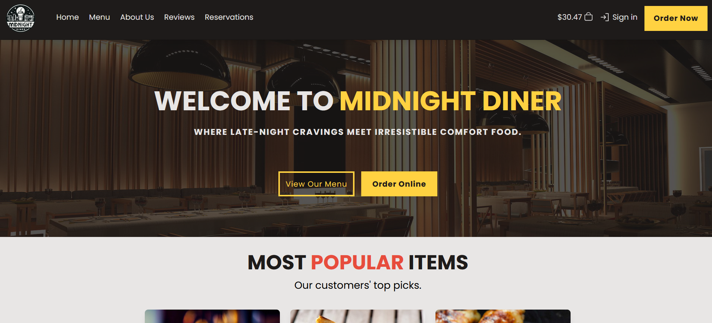

# Midnight Diner

Welcome to the Midnight Diner project! This full-stack MERN (MongoDB, Express, React, Node.js) application allows you to explore a delightful culinary experience. Follow the instructions below to set up the project locally on your machine.



## Prerequisites

Before you begin, ensure you have the following installed on your machine:

- **Docker Desktop**

## Getting Started

1. **Clone the Repository:**

   First, clone the repository to your local machine using the following command:
   
   ```bash
   git clone https://github.com/MarshallNickolauson/midnight-diner.git
   ```

2. **Run Docker Compose:**

   In the root directory of the project run:
   
   ```bash
   docker-compose up --build -d
   ```

2a. **Run Menu Items Seeder:**

   If you're starting the app for the first time, you can populate the menu with items.
   
   In the root directory of the project run:
   
   ```bash
   docker-compose exec seeder node /app/seeder.js
   ```

2b. **Starting and Stopping App:**
   
   In the root directory of the project,
   stop the app containers with:
   
   ```bash
   docker-compose down
   ```
   
   and start the app containers with:
   
   ```bash
   docker-compose up
   ```

3. **Open Your Browser:**

   Open your browser and go to:
   
   ```bash
   http://localhost:3000
   ```

   You should see the Midnight Diner application up and running!

4. **Admin/Customer Accounts:**

   If you ran the seeder command, you can log into the site as as admin with:
   ```
   email: 'admin@email.com'
   password: 'password'
   ```

   You can also create a new customer account by following the UI links.

   **You can interact with it completely and everything you do will be saved to the Docker Desktop volume.**
   **So when you restart, all your changes will persist :)**
